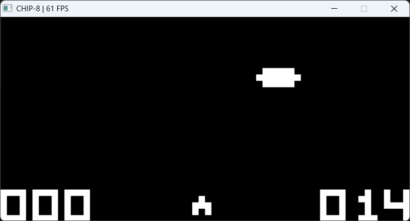

# CHIP-8 Virtual Machine

A CHIP-8 interpreter written in C++23 with SDL2 for graphics, input, and audio.




## Overview

[CHIP-8](https://en.wikipedia.org/wiki/CHIP-8) is an interpreted programming language from the 1970s, originally designed for the COSMAC VIP microcomputer. It has a simple instruction set (34 opcodes), a 64×32 monochrome (black and white) display, a 16-key hex keypad, and two countdown timers — making it an ideal target for learning how virtual machines and interpreters work at a low level.

This project implements:

- A complete CHIP-8 interpreter covering all 34 opcodes
- An SDL2 host layer with display rendering, keyboard input, and audio output
- 65 unit tests using GoogleTest, validating every opcode and core behavior
- A clean separation between the platform-independent interpreter core and the SDL2 frontend

## Architecture

```
┌─────────────────────────────────────────────────────┐
│  Host Layer (SDL2)                                  │
│  Display · Input · Audio · Main Loop                │
│                                                     │
│  Links: chip8_core + SDL2                           │
├─────────────────────────────────────────────────────┤
│  Core Library (chip8_core)                          │
│  Chip8 class · types.hpp                            │
│                                                     │
│  Pure C++ standard library — no external deps       │
├─────────────────────────────────────────────────────┤
│  Tests (GoogleTest)                                 │
│  Links: chip8_core only — no SDL2 needed            │
└─────────────────────────────────────────────────────┘
```

The core library (`chip8_core`) is a static library with zero external dependencies. It contains the full interpreter state and logic using only the C++ standard library. The host layer and test suite both link against it independently.

This separation exists for three reasons:

1. **Testability** — All 65 unit tests run against the core directly, with no SDL2 window or audio device required.
2. **Portability** — The core can be driven by any frontend (SDL2, ncurses, a web browser via Emscripten) without modification.
3. **Build flexibility** — If SDL2 isn't installed, CMake still builds the core and test suite. The host executable is simply skipped.

The `Chip8` class exposes its state (registers, memory, display, keypad) as public members rather than behind getters. This was a deliberate trade-off: in a project this size, the simplicity and direct testability outweigh the encapsulation benefits. The host reads `display[]` and `keypad[]` directly, and tests can set up any internal state in a single line.

### Timing Model

The core has no concept of real time. It exposes two functions:

- `cycle()` — executes one instruction
- `tick_timers()` — decrements the delay and sound timers by one

The host is responsible for calling `cycle()` N times per frame (default 12) and `tick_timers()` once per frame at 60 Hz. This keeps the core deterministic and easy to test, while the host controls the actual speed.

## The Interpreter

### Fetch / Decode / Execute

Each call to `cycle()` does three things:

1. **Fetch** — Reads two bytes from `memory[pc]` and `memory[pc+1]`, combines them into a 16-bit big-endian opcode, and advances `pc` by 2.

2. **Decode** — Extracts fields from the opcode using bitwise operations:
   - `x` = bits 11–8 (register index)
   - `y` = bits 7–4 (register index)
   - `kk` = bits 7–0 (8-bit immediate)
   - `nnn` = bits 11–0 (12-bit address)
   - `n` = bits 3–0 (4-bit value)

3. **Execute** — A `switch` on the top nibble (`opcode & 0xF000`) dispatches to the correct handler, with nested switches for the `0x0___`, `0x8___`, `0xE___`, and `0xF___` groups.

There is one special case: the `Fx0A` (wait for key) instruction sets a `waiting_for_key` flag. On subsequent cycles, the interpreter skips fetching and instead polls the keypad array until a key is found.

### Opcodes

All 34 opcodes, grouped by what they do:

**Control Flow**
| Opcode | Name | What it does |
|--------|------|-------------|
| `00E0` | CLS | Clears the display |
| `00EE` | RET | Returns from a subroutine (pops the stack) |
| `1nnn` | JP | Jumps to address `nnn` |
| `2nnn` | CALL | Calls subroutine at `nnn` (pushes return address) |
| `Bnnn` | JP V0 | Jumps to `nnn + V0` |

**Conditional Skips**
| Opcode | Name | What it does |
|--------|------|-------------|
| `3xkk` | SE Vx, byte | Skips next instruction if `Vx == kk` |
| `4xkk` | SNE Vx, byte | Skips if `Vx != kk` |
| `5xy0` | SE Vx, Vy | Skips if `Vx == Vy` |
| `9xy0` | SNE Vx, Vy | Skips if `Vx != Vy` |
| `Ex9E` | SKP Vx | Skips if key `Vx` is pressed |
| `ExA1` | SKNP Vx | Skips if key `Vx` is not pressed |

**Load & Store**
| Opcode | Name | What it does |
|--------|------|-------------|
| `6xkk` | LD Vx, byte | Sets `Vx = kk` |
| `8xy0` | LD Vx, Vy | Sets `Vx = Vy` |
| `Annn` | LD I, addr | Sets index register `I = nnn` |
| `Fx07` | LD Vx, DT | Sets `Vx` to the delay timer value |
| `Fx0A` | LD Vx, K | Blocks until a key is pressed, stores it in `Vx` |
| `Fx15` | LD DT, Vx | Sets delay timer to `Vx` |
| `Fx18` | LD ST, Vx | Sets sound timer to `Vx` |
| `Fx29` | LD F, Vx | Points `I` to the font sprite for digit `Vx` |
| `Fx33` | BCD Vx | Stores the BCD representation of `Vx` at `I`, `I+1`, `I+2` |
| `Fx55` | LD [I], Vx | Stores `V0` through `Vx` into memory starting at `I` |
| `Fx65` | LD Vx, [I] | Loads `V0` through `Vx` from memory starting at `I` |

**Arithmetic & Logic**
| Opcode | Name | What it does | VF |
|--------|------|-------------|-----|
| `7xkk` | ADD Vx, byte | `Vx += kk` | unchanged |
| `8xy4` | ADD Vx, Vy | `Vx += Vy` | 1 if carry, else 0 |
| `8xy5` | SUB Vx, Vy | `Vx -= Vy` | 1 if no borrow, else 0 |
| `8xy7` | SUBN Vx, Vy | `Vx = Vy - Vx` | 1 if no borrow, else 0 |
| `8xy1` | OR Vx, Vy | `Vx \|= Vy` | reset to 0 |
| `8xy2` | AND Vx, Vy | `Vx &= Vy` | reset to 0 |
| `8xy3` | XOR Vx, Vy | `Vx ^= Vy` | reset to 0 |
| `8xy6` | SHR Vx, Vy | `Vx = Vy >> 1` | least significant bit before shift |
| `8xyE` | SHL Vx, Vy | `Vx = Vy << 1` | most significant bit before shift |

**Graphics**
| Opcode | Name | What it does |
|--------|------|-------------|
| `Dxyn` | DRW Vx, Vy, n | Draws an n-byte sprite at position (Vx, Vy) using XOR. Sets VF = 1 if any pixel is turned off (collision). |

**Other**
| Opcode | Name | What it does |
|--------|------|-------------|
| `Cxkk` | RND Vx, byte | `Vx = random_byte & kk` |
| `Fx1E` | ADD I, Vx | `I += Vx` |

### CHIP-8 Quirks

Different CHIP-8 interpreters throughout history have handled certain instructions differently. This implementation follows the **original COSMAC VIP behavior** for most quirks:

- **VF reset on logic ops** — `OR`, `AND`, and `XOR` (`8xy1`, `8xy2`, `8xy3`) reset `VF` to 0 after execution. Later SCHIP interpreters left `VF` unchanged, but the original VIP always cleared it.

- **Shift source register** — `SHR` and `SHL` (`8xy6`, `8xyE`) shift the value of `Vy` and store the result in `Vx`. SCHIP interpreters ignore `Vy` and shift `Vx` in place. The original VIP used `Vy`.

- **Sprite clipping** — Sprites that go past the right or bottom edge of the screen are clipped rather than wrapping around. The starting coordinates are wrapped (`x % 64`, `y % 32`), but individual sprite rows and columns that fall outside the display are simply not drawn.

- **Store/Load don't modify I** — `Fx55` and `Fx65` leave the index register `I` unchanged after the operation. The original VIP incremented `I`, but this implementation follows the more common modern convention.

## SDL2 Host Layer

The host layer wraps SDL2 resources using RAII — each class acquires its SDL resources in the constructor and releases them in the destructor, with copy and assignment explicitly deleted to prevent double-free bugs.

### Display

The `Display` class manages an `SDL_Window`, `SDL_Renderer`, and `SDL_Texture`. The texture is created at native CHIP-8 resolution (64×32) with `SDL_TEXTUREACCESS_STREAMING` and pixel format `RGBA8888`.

On each render call, the 2048-element `uint8_t` framebuffer is converted to RGBA pixels (1 → white `0xFFFFFFFF`, 0 → black `0x000000FF`), uploaded to the texture via `SDL_UpdateTexture`, and drawn to the window with `SDL_RenderCopy`. The scaling from 64×32 to the window size (default 640×320) is handled entirely by SDL's renderer — no manual pixel scaling needed.

### Input

The `Input` class translates SDL keyboard events to CHIP-8 keypad state. It uses **scancodes** rather than keycodes, making the mapping layout-independent (works on AZERTY, Dvorak, etc.):

```
Keyboard                CHIP-8 Keypad
┌───┬───┬───┬───┐      ┌───┬───┬───┬───┐
│ 1 │ 2 │ 3 │ 4 │      │ 1 │ 2 │ 3 │ C │
├───┼───┼───┼───┤      ├───┼───┼───┼───┤
│ Q │ W │ E │ R │  →   │ 4 │ 5 │ 6 │ D │
├───┼───┼───┼───┤      ├───┼───┼───┼───┤
│ A │ S │ D │ F │      │ 7 │ 8 │ 9 │ E │
├───┼───┼───┼───┤      ├───┼───┼───┼───┤
│ Z │ X │ C │ V │      │ A │ 0 │ B │ F │
└───┴───┴───┴───┘      └───┴───┴───┴───┘
```

The `poll()` method returns an `Action` enum (`none`, `quit`, `toggle_pause`, `reset`) to handle host-level commands separately from game input.

### Audio

The `Audio` class opens an SDL audio device and generates a 440 Hz square wave through a static callback function. The callback writes `+volume` or `-volume` samples based on a phase accumulator, producing the classic CHIP-8 beep sound.

Playback is toggled with `SDL_PauseAudioDevice` — `beep()` unpauses the device, `silence()` pauses it. A boolean flag prevents redundant SDL calls.

### Main Loop

The main loop runs at 60 FPS and follows this sequence each frame:

1. **Poll input** — process SDL events, handle quit/pause/reset
2. **Run cycles** — execute N instructions (default 12, configurable with `--speed`)
3. **Tick timers** — decrement delay and sound timers (skipped when paused)
4. **Render** — update the display if the interpreter set `draw_flag`
5. **Audio** — beep if `sound_timer > 0`, silence otherwise
6. **Update title** — show FPS counter (or `[PAUSED]`) every second
7. **Frame cap** — `SDL_Delay` for the remaining time to hit ~16 ms per frame

## Build

### Prerequisites

- A C++23 compiler (GCC 13+, Clang 16+, or MSVC 19.36+)
- CMake 3.20 or later
- SDL2 development libraries (optional — the core and tests build without it)

GoogleTest is fetched automatically by CMake at configure time.

### Building

```bash
cmake -B build -G Ninja
cmake --build build
```

On Windows with MinGW, you may need to pass the SDL2 path:

```bash
cmake -B build -G Ninja -DSDL2_DIR="<path-to-sdl2>/lib/cmake/SDL2"
```

If SDL2 is not found, CMake will print a message and build just the core library and test suite:

```
-- SDL2 not found — skipping host build (core + tests only)
```

### Running Tests

```bash
ctest --test-dir build --output-on-failure
```

## Usage

```
chip8 [--scale N] [--speed N] <rom>
```

| Flag | Default | Description |
|------|---------|-------------|
| `--scale` | 10 | Window scale multiplier (10 → 640×320) |
| `--speed` | 12 | CPU cycles per frame (higher = faster) |

### Controls

| Key | Action |
|-----|--------|
| 1 2 3 4 / Q W E R / A S D F / Z X C V | CHIP-8 keypad (see mapping above) |
| P | Pause / Resume |
| Backspace | Reset (reload ROM) |
| Escape | Quit |

## Testing

The test suite has 65 tests across 8 groups, all running against the core library without SDL2:

| Group | Tests | What's covered |
|-------|-------|----------------|
| `Chip8Init` | 5 | Initial state — PC, registers, memory, display |
| `Chip8LoadRom` | 2 | ROM loading and size validation |
| `Chip8Timers` | 4 | Timer decrement, beep flag, underflow protection |
| `OpcodeGroupA` | 15 | Control flow, skips, loads, jumps |
| `OpcodeGroupB` | 12 | Arithmetic, logic, shifts (including VF behavior) |
| `OpcodeGroupC` | 10 | Timers, memory ops, BCD, RNG masking |
| `OpcodeGroupD` | 6 | Sprite drawing, collision, clipping, wrapping |
| `OpcodeGroupE` | 5 | Keypad skips, wait-for-key blocking |
| `Integration` | 2 | Multi-instruction sequences (CALL→RET, conditional skip chains) |

Tests use an `exec()` helper that writes a 2-byte opcode at the current `pc` and runs one cycle, keeping each test focused on a single behavior:

```cpp
static void exec(Chip8& vm, uint16_t opcode) {
    vm.memory[vm.pc]     = (opcode >> 8) & 0xFF;
    vm.memory[vm.pc + 1] = opcode & 0xFF;
    vm.cycle();
}
```

## C++ Features

| Feature | Standard | Where it's used |
|---------|----------|----------------|
| `inline constexpr` variables | C++17 | Compile-time constants in `types.hpp` |
| `std::span` | C++20 | Type-safe, non-owning ROM data in `load_rom()` |
| `std::mt19937` + `random_device` | C++11 | Seeded PRNG for the `RND` opcode |
| `std::array` | C++11 | All fixed-size state (memory, registers, display, stack) |
| `enum class` | C++11 | Type-safe host actions (`Action::quit`, `toggle_pause`, etc.) |
| Init-statement in `if` | C++17 | Scancode-to-key mapping in `input.cpp` |
| RAII | Idiom | `Display` and `Audio` manage SDL resources via constructor/destructor |
| Deleted copy/assignment | C++11 | Prevents accidental duplication of SDL resource handles |
| Default member initializers | C++11 | All `Chip8` members value-initialized in the class definition |
| `static constexpr` array | C++17 | Font sprite data embedded in the `Chip8` class |
| `FetchContent` | CMake | GoogleTest pulled at configure time — no manual dependency setup |

## Project Structure

```
chip8-vm/
├── CMakeLists.txt              Top-level build config (C++23, SDL2 detection, testing)
├── README.md
├── src/
│   ├── core/
│   │   ├── CMakeLists.txt      chip8_core static library (no external deps)
│   │   ├── types.hpp           Constants: memory size, display dimensions, addresses
│   │   ├── chip8.hpp           Chip8 class — interpreter state and API
│   │   └── chip8.cpp           Interpreter — constructor, load_rom, cycle, tick_timers
│   └── host/
│       ├── CMakeLists.txt      chip8 executable (links chip8_core + SDL2)
│       ├── display.hpp/cpp     RAII SDL window/renderer/texture, framebuffer rendering
│       ├── input.hpp/cpp       Keyboard→keypad mapping, pause/reset/quit actions
│       ├── audio.hpp/cpp       440 Hz square-wave beep via SDL audio callback
│       └── main.cpp            CLI parsing, main loop, FPS tracking
├── tests/
│   ├── CMakeLists.txt          GoogleTest via FetchContent, test discovery
│   ├── test_chip8.cpp          Initialization, ROM loading, timer tests
│   └── test_opcodes.cpp        All 34 opcodes + integration tests
└── roms/                       Test ROM files
```

## License

MIT
